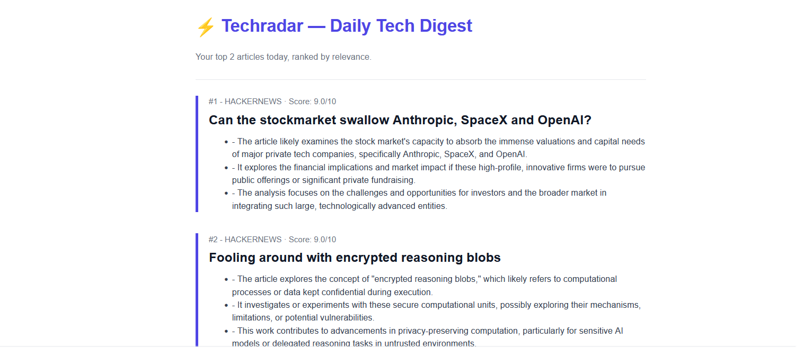
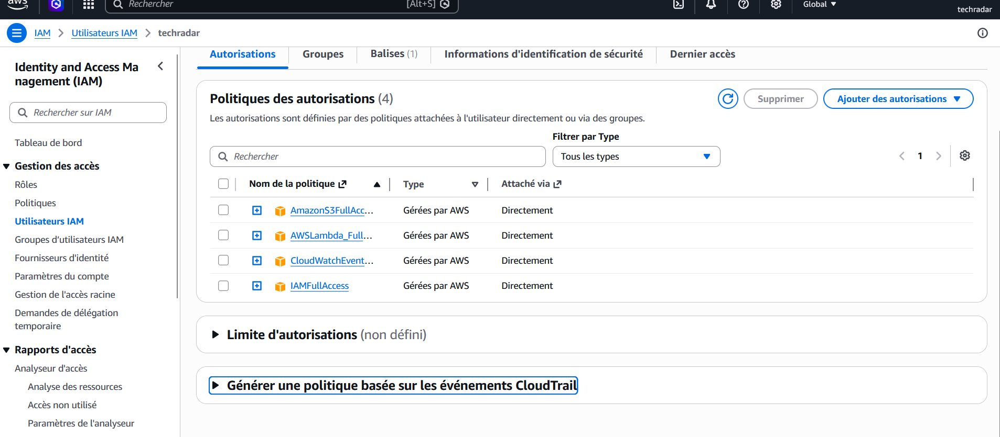

# 🔍 TechRadar — Automated Tech Intelligence Agent

<p align="center">
  
  
  
  
  
</p>

> **Stop scrolling Reddit and Hacker News.** TechRadar scans the web every morning, uses AI to rank what matters, and delivers a personalized tech digest straight to your inbox at 8 AM.


## 📸 Preview

The daily digest email, ranked by relevance score:
<p align="center">
  
</p>

Aws console, Policies and permissions in AWS:
<p align="center">
  
</p>


---

## 📖 Table of Contents

- [What it does](#-what-it-does)
- [Architecture](#%EF%B8%8F-architecture)
- [Tech Stack](#%EF%B8%8F-tech-stack)
- [Project Structure](#-project-structure)
- [Getting Started](#-getting-started)
- [SendGrid Setup](#-sendgrid-setup)
- [AWS Setup](#%EF%B8%8F-aws-setup)
- [Configuration](#%EF%B8%8F-configuration)
- [How It Works](#-how-it-works)
- [Known Issues](#-known-issues)

---

## 🎯 What it does

TechRadar is a serverless agent that runs every morning on AWS Lambda and delivers a curated tech digest to my inbox.

- 🌐 Scrapes the latest articles from **Hacker News API** and **Reddit RSS**
- 🤖 Uses **Google Gemini 2.0 Flash** to summarize each article and score its relevance (0–10) against configured topics
- 📧 Sends the top 10 picks as a clean HTML email via **SendGrid**
- 🔄 Caches processed article URLs in **AWS S3** to avoid duplicates between runs
- ⏰ Triggered daily at 8 AM Paris time by **AWS EventBridge**

---

## 🏗️ Architecture

```
┌──────────────────┐
│   EventBridge    │  cron(0 7 * * ? *) — 8 AM Paris
└────────┬─────────┘
         │ triggers
         ▼
┌──────────────────────────────────────────────┐
│              AWS Lambda Function              │
│                                              │
│  ┌──────────┐  ┌──────────┐  ┌────────────┐  │
│  │ Scraper  │─▶│ Gemini   │─▶│   Email    │  │
│  │ HN + RSS │  │ AI       │  │  Builder   │  │
│  └────┬─────┘  └──────────┘  └─────┬──────┘  │
│       │                             │         │
└───────┼─────────────────────────────┼─────────┘
        │                             │
        ▼                             ▼
   ┌─────────┐                  ┌──────────┐
   │   AWS   │                  │ SendGrid │
   │   S3    │                  │   API    │
   │ (cache) │                  └────┬─────┘
   └─────────┘                       │
                                     ▼
                              📧 your inbox
```

---

## 🔀 Architecture LangGraph

Since the refactor, the sequential pipeline in `main.py` is replaced by a `StateGraph` defined in `src/graph.py`. Each step is an isolated node that reads from and writes to a shared `TechWatchState`.

### Graphe d'execution

```
START
  |
  v
collect_articles
  |
  +-- [error == "no_articles"] ---------> END (log: aucun article aujourd'hui)
  |
  +-- [ok] --> filter_and_deduplicate --> summarize_with_gemini
                                                |
                  +-- [gemini_error, retry < 3] --> retry_gemini --.
                  |                                                  |
                  |                         <------------------------'
                  |
                  +-- [gemini_error, retry >= 3] --> END (log: echec apres 3 tentatives)
                  |
                  +-- [ok] --> send_email --> END
```

### TypedDict d'etat partage

```python
class TechWatchState(TypedDict):
    raw_articles: list[dict]       # articles bruts des scrapers
    filtered_articles: list[dict]  # apres deduplication cache S3
    summaries: list[dict]          # resumes + scores Gemini
    email_sent: bool               # True si SendGrid a repondu 202
    retry_count: int               # nombre de tentatives Gemini echouees
    error: str | None              # "no_articles" | "gemini_error" | None
    run_date: str                  # date ISO de l'execution Lambda
```

### Description des noeuds

| Noeud | Role | Cle(s) modifiees |
|---|---|---|
| `collect_articles` | Scrape HN + RSS, deduplique par URL | `raw_articles`, `error` |
| `filter_and_deduplicate` | Filtre les URLs deja vues dans le cache S3 | `filtered_articles` |
| `summarize_with_gemini` | Appelle Gemini via `ChatGoogleGenerativeAI` | `summaries`, `error`, `retry_count` |
| `retry_gemini` | Remet `error` a None et vide les resumes partiels | `error`, `summaries` |
| `send_email` | Envoie le digest HTML via SendGrid, sauvegarde le cache | `email_sent` |

### Avant / apres la refacto

| | Avant (`main.py`) | Apres (`graph.py`) |
|---|---|---|
| Orchestration | 44 lignes sequentielles | `StateGraph` LangGraph |
| Gestion d'erreurs | `try/except` locaux, pipeline continue | Routage conditionnel avec retry automatique |
| Retry Gemini | Aucun (article saute) | 3 tentatives avec compteur d'etat |
| Observabilite | `print()` inline | `loguru` structure par noeud |
| Testabilite | Test du pipeline entier | Chaque noeud testable independamment |
| Lignes d'orchestration | ~44 | ~20 (hors definition des noeuds) |

---

## 🛠️ Tech Stack

| Layer | Technology |
|---|---|
| **Language** | Python 3.11+ |
| **AI Model** | Google Gemini 2.5 Flash |
| **Orchestration** | LangGraph + LangChain Google GenAI |
| **Scraping** | HN Firebase API, `feedparser`, `praw` |
| **Compute** | AWS Lambda |
| **Storage** | AWS S3 (deduplication cache) |
| **Scheduling** | AWS EventBridge |
| **Email** | SendGrid |
| **Logging** | Loguru |
| **CI/CD** | GitHub Actions |

---

## 📁 Project Structure

```
techradar/
├── src/
│   ├── __init__.py
│   ├── config.py              # Environment variables loader
│   ├── state.py               # TechWatchState TypedDict (LangGraph shared state)
│   ├── graph.py               # LangGraph StateGraph with 5 nodes
│   ├── main.py                # Legacy sequential pipeline (kept for reference)
│   ├── cache.py               # AWS S3 cache (deduplication)
│   ├── lambda_handler.py      # AWS Lambda entry point (calls graph.app)
│   ├── agent/
│   │   ├── summarizer.py      # Gemini AI summarization + scoring (legacy)
│   │   └── filter.py          # Ranking and top N selection (legacy)
│   ├── scrapers/
│   │   ├── __init__.py        # Merge + deduplicate all sources
│   │   ├── hackernews.py      # Hacker News API scraper
│   │   └── rss.py             # RSS parser
│   └── email/
│       └── digest.py          # HTML email builder + SendGrid sender
├── tests/
│   ├── test_graph_no_articles.py   # Graph exits cleanly when no articles collected
│   ├── test_graph_gemini_retry.py  # Retry logic: fail x2 then succeed
│   └── test_graph_full.py          # End-to-end with all external APIs mocked
├── .github/workflows/
│   └── daily.yml              # GitHub Actions (backup schedule + CI)
├── .env.example               # Environment variables template
├── .gitignore
├── pyproject.toml
├── uv.lock
└── README.md
```

---

## 🚀 Getting Started

### Prerequisites

- Python 3.11+
- AWS CLI installed and configured (`aws configure`)
- A **Google Gemini API key** (free at [aistudio.google.com](https://aistudio.google.com))
- A **SendGrid account** (free at [sendgrid.com](https://sendgrid.com))

### Run locally

```bash
# 1. Clone the repository
git clone https://github.com/liliandoublet/techradar.git
cd techradar

# 2. Create virtual environment
uv venv
source .venv/bin/activate

# 3. Install dependencies
uv sync

# 4. Configure environment
cp .env.example .env
# Edit .env with your API keys

# 5. Run the agent locally
python3 -m src.main
```

---

## 📧 SendGrid Setup

SendGrid handles email delivery. The free tier allows up to **100 emails per day** — more than enough for a daily digest.

### 1. Create a SendGrid account

Sign up at [sendgrid.com](https://signup.sendgrid.com/) and verify your email address.

### 2. Verify a sender identity

SendGrid requires you to verify the address you'll send **from** before sending any email.

1. In the SendGrid dashboard, go to **Settings → Sender Authentication**
2. Click **Verify a Single Sender**
3. Fill in the form with the email you want to use as `SENDER_EMAIL` (your personal Gmail works fine)
4. Click the verification link sent to that address ✅

### 3. Create an API key

1. Go to **Settings → API Keys**
2. Click **Create API Key**
3. Name it `techradar`
4. Select **Restricted Access** → grant **Mail Send → Full Access**
5. Click **Create & View**
6. **Copy the key immediately** — it is shown only once

Paste it into your `.env` as `SENDGRID_API_KEY`.

---

## ☁️ AWS Setup

This section documents every step taken to deploy TechRadar on AWS from scratch.

### 1. Install the AWS CLI (WSL / Linux)

```bash
curl "https://awscli.amazonaws.com/awscli-exe-linux-x86_64.zip" -o "awscliv2.zip"
sudo apt-get install unzip -y
unzip awscliv2.zip
sudo ./aws/install

# Verify
aws --version
```

### 2. Create an IAM user for programmatic access

AWS best practice: never use the root account for CLI operations.

In the **AWS Console → IAM → Users → Create user**:

1. Username: `techradar`
2. Click **Next** (no console access needed)
3. **Attach policies directly** — add the following:
   - `AmazonS3FullAccess`
   - `AWSLambda_FullAccess`
   - `CloudWatchEventsFullAccess`
   - `IAMFullAccess` *(needed to create the Lambda execution role)*
4. Click **Next → Create user**
5. Open the user → **Security credentials → Create access key**
6. Choose **Command Line Interface (CLI)**
7. Save the **Access Key ID** and **Secret Access Key** — shown only once

### 3. Configure the AWS CLI

```bash
aws configure
```

Enter:
```
AWS Access Key ID:     AKIAxxxxxxxxxxxxxxxx
AWS Secret Access Key: xxxxxxxxxxxxxxxxxxxxxxxxxxxxxxxx
Default region name:   eu-west-1
Default output format: json
```

Credentials are stored in `~/.aws/credentials` and picked up automatically by `boto3` — no need to put them in `.env`.

Verify:
```bash
aws sts get-caller-identity
```

Expected output:
```json
{
    "UserId": "...",
    "Account": "************",
    "Arn": "arn:aws:iam::************:user/REDACTED"
}
```

### 4. Create the S3 bucket (deduplication cache)

```bash
aws s3 mb s3://techradar-cache --region eu-west-1

# Verify
aws s3 ls
```

S3 stores a `seen_articles.json` file containing all previously sent article URLs. This prevents the same articles from appearing in multiple digests.

### 5. Create the Lambda execution role

Lambda needs an IAM role to be allowed to access S3 and write logs.

```bash
# Create the role
aws iam create-role \
  --role-name techradar-lambda-role \
  --assume-role-policy-document '{
    "Version": "2012-10-17",
    "Statement": [{
      "Effect": "Allow",
      "Principal": {"Service": "lambda.amazonaws.com"},
      "Action": "sts:AssumeRole"
    }]
  }'

# Attach S3 access
aws iam attach-role-policy \
  --role-name techradar-lambda-role \
  --policy-arn arn:aws:iam::aws:policy/AmazonS3FullAccess

# Attach CloudWatch logging
aws iam attach-role-policy \
  --role-name techradar-lambda-role \
  --policy-arn arn:aws:iam::aws:policy/service-role/AWSLambdaBasicExecutionRole
```

### 6. Build and deploy the Lambda function

Lambda runs on Amazon Linux — dependencies must be compiled for that environment. Use Docker to ensure binary compatibility:

```bash
# Generate requirements.txt from pyproject.toml (needed for Docker build)
uv pip compile pyproject.toml -o requirements.txt

# Build dependencies inside an Amazon Linux container
mkdir package
docker run --rm \
  -v $(pwd):/var/task \
  --entrypoint pip \
  public.ecr.aws/lambda/python:3.11 \
  install -r /var/task/requirements.txt -t /var/task/package/

# Package the code
sudo chown -R $USER:$USER package/
cp -r src package/
cd package && zip -r ../techradar.zip . && cd ..

# Deploy
ACCOUNT_ID=$(aws sts get-caller-identity --query Account --output text)

aws lambda create-function \
  --function-name techradar-digest \
  --runtime python3.11 \
  --role arn:aws:iam::${ACCOUNT_ID}:role/techradar-lambda-role \
  --handler src.lambda_handler.handler \
  --zip-file fileb://techradar.zip \
  --timeout 600 \
  --memory-size 256 \
  --region eu-west-1 \
  --environment "Variables={
    GEMINI_API_KEY=your-key,
    SENDGRID_API_KEY=your-key,
    SENDER_EMAIL=your@gmail.com,
    DIGEST_RECIPIENT=your@gmail.com,
    TOPICS=AI_Python_Cloud_LLM,
    MAX_ARTICLES=10
  }"
```

To redeploy after a code change:

```bash
# Rebuild
sudo rm -rf package techradar.zip && mkdir package
docker run --rm \
  -v $(pwd):/var/task \
  --entrypoint pip \
  public.ecr.aws/lambda/python:3.11 \
  install -r /var/task/requirements.txt -t /var/task/package/
sudo chown -R $USER:$USER package/
cp -r src package/
cd package && zip -r ../techradar.zip . && cd ..

# Update
aws lambda update-function-code \
  --function-name techradar-digest \
  --zip-file fileb://techradar.zip \
  --region eu-west-1
```

### 7. Schedule daily execution with EventBridge

```bash
# Create the rule (7 AM UTC = 8 AM Paris)
aws events put-rule \
  --name techradar-daily \
  --schedule-expression "cron(0 7 * * ? *)" \
  --state ENABLED \
  --region eu-west-1

# Allow EventBridge to invoke Lambda
aws lambda add-permission \
  --function-name techradar-digest \
  --statement-id techradar-eventbridge \
  --action lambda:InvokeFunction \
  --principal events.amazonaws.com \
  --region eu-west-1

# Connect the rule to Lambda
ACCOUNT_ID=$(aws sts get-caller-identity --query Account --output text)
aws events put-targets \
  --rule techradar-daily \
  --region eu-west-1 \
  --targets "Id=techradar,Arn=arn:aws:lambda:eu-west-1:${ACCOUNT_ID}:function:techradar-digest"
```

### 8. Test manually

```bash
aws lambda invoke \
  --function-name techradar-digest \
  --region eu-west-1 \
  --payload '{}' \
  --cli-read-timeout 700 \
  /tmp/output.json && cat /tmp/output.json
```

Expected output:
```json
{"statusCode": 200, "body": "TechRadar digest sent successfully!"}
```

### 9. Reset the cache (force a full rerun)

To re-send all articles regardless of what was already processed:

```bash
aws s3 rm s3://techradar-cache/seen_articles.json --region eu-west-1
```

---

## ⚙️ Configuration

All configuration lives in a `.env` file for local runs. The same variables are set in the Lambda console for production.

```env
# === AI ===
GEMINI_API_KEY=AIxxxxxxxxxxxxxxxx

# === EMAIL ===
SENDGRID_API_KEY=SG.xxxxxxxxxxxxxxxxxxxxxxxxxxxxxx
DIGEST_RECIPIENT=you@gmail.com
SENDER_EMAIL=you@gmail.com        # must match the verified SendGrid sender

# === AGENT SETTINGS ===
TOPICS=AI,Python,Cloud,LLM        # used by Gemini to score relevance
MAX_ARTICLES=10                   # number of articles in the digest

# === AWS ===
# AWS credentials are NOT stored here.
# They are read from ~/.aws/credentials (configured via `aws configure`).
AWS_REGION=eu-west-1
S3_BUCKET_NAME=techradar-cache
```

> **Note on `TOPICS`:** When setting this variable in the Lambda environment, replace commas with underscores (`AI_Python_Cloud_LLM`) due to AWS CLI parsing constraints. `config.py` converts them back automatically.

---

## 🔍 How It Works

### Phase 1 — Data Collection
Each run fetches the latest articles from Hacker News (Firebase API) and Reddit (RSS). Article URLs are checked against the S3 cache — duplicates are discarded immediately.

### Phase 2 — AI Processing
New articles are sent one by one to Gemini 2.0 Flash. For each article, Gemini returns:
- A 3-bullet summary
- A relevance score (0–10) based on the configured `TOPICS`

A 10-second delay is added between requests to respect the free tier rate limit (5 req/min).

### Phase 3 — Ranking & Selection
Articles are sorted by relevance score (descending). The top `MAX_ARTICLES` are selected.

### Phase 4 — Delivery
A clean HTML email is generated and sent via SendGrid. All processed URLs are written back to S3 to prevent future duplicates.

### Phase 5 — Scheduling
AWS EventBridge triggers the Lambda function every day at 7:00 AM UTC (8:00 AM Paris time).

---

## 🐛 Known Issues

| Error | Cause | Fix |
|---|---|---|
| `429 RESOURCE_EXHAUSTED` | Gemini free tier: 5 req/min | `time.sleep(10)` between requests |
| `503 UNAVAILABLE` | Gemini overloaded | Article skipped, pipeline continues |
| `403 Forbidden` SendGrid | Sender email not verified | Verify in SendGrid Sender Authentication |
| Lambda timeout | Pipeline exceeds 5 min | Timeout set to 600s, articles limited to 10 |
| `pydantic_core` import error | Binary compiled for wrong OS | Build with Docker Amazon Linux container |
| `No module named src` | Wrong run command | Use `python3 -m src.main` not `python3 src/main.py` |
| `Read timeout` AWS CLI | CLI times out before Lambda finishes | Use `--cli-read-timeout 700` |

---

## 📄 License

MIT — see the [LICENSE](LICENSE) file for details.

---

<p align="center">
  <sub>Built by <a href="https://github.com/liliandoublet">Lilian Doublet</a></sub>
</p>
